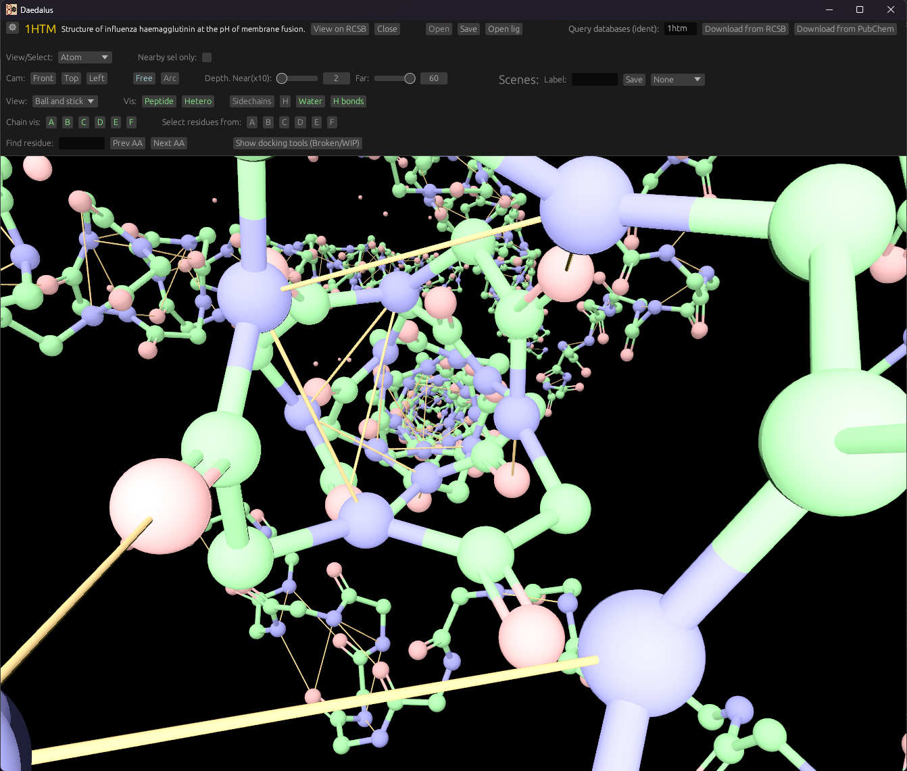
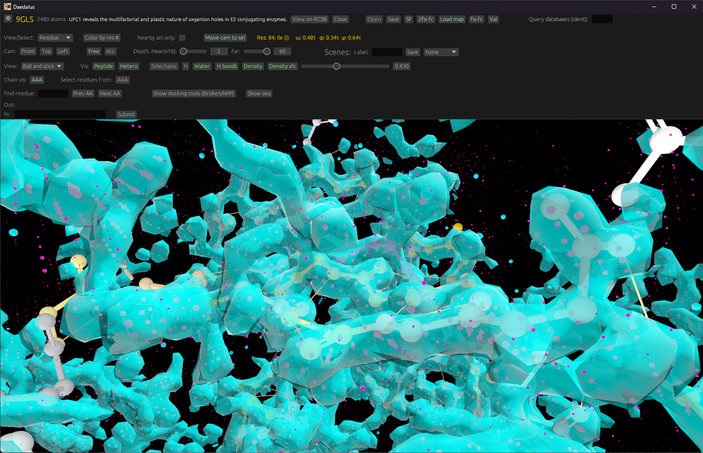
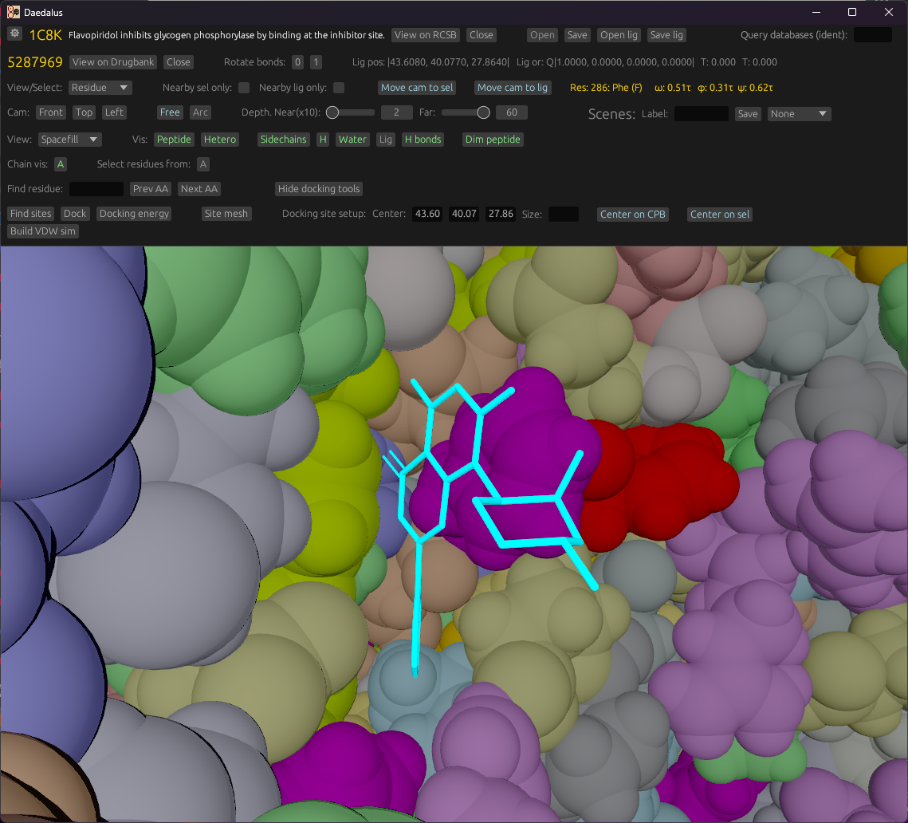
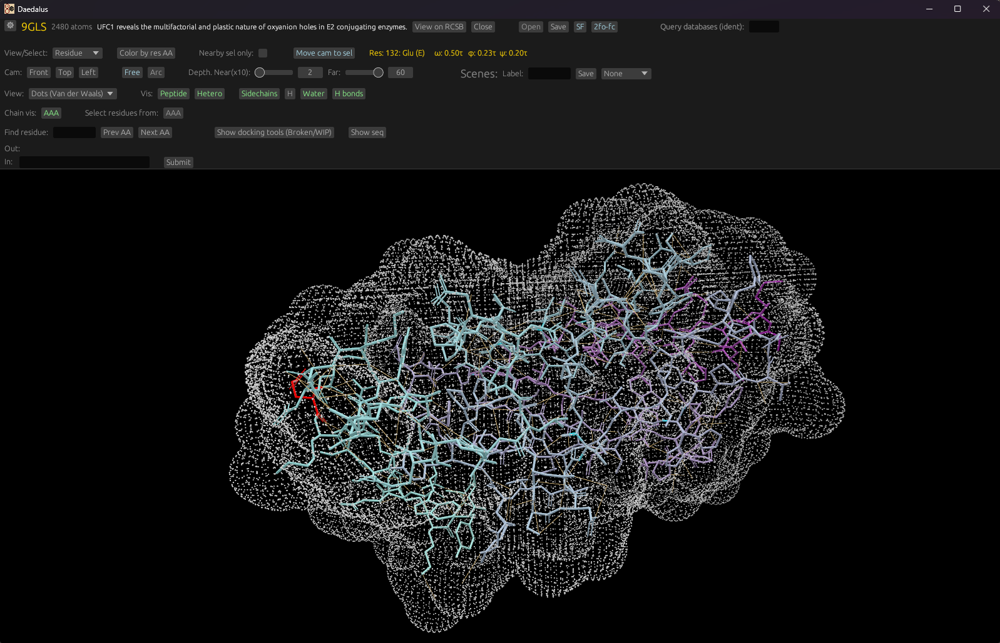
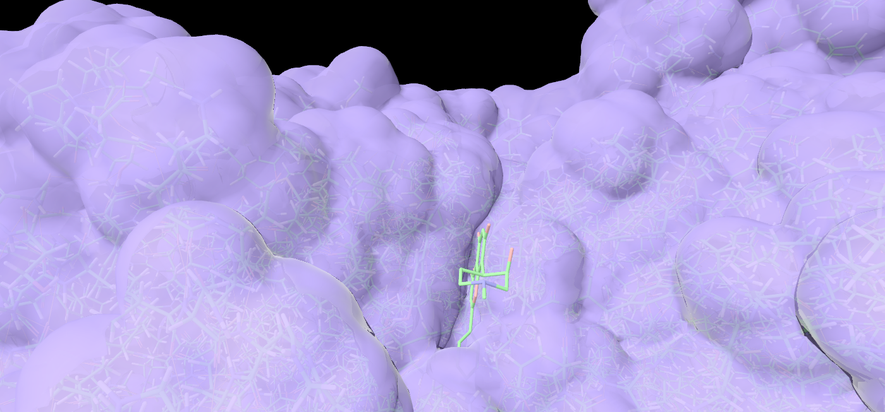
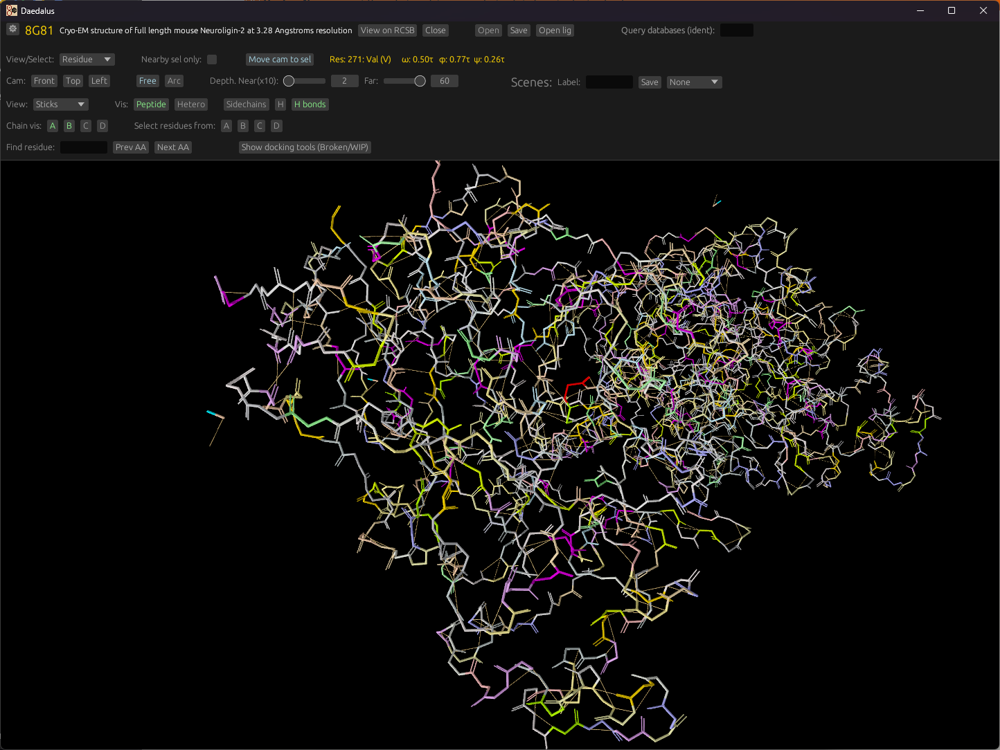

# Daedalus molecule viewer

[//]: # ([![Crate]&#40;https://img.shields.io/crates/v/daedalus.svg&#41;]&#40;https://crates.io/crates/daedalus&#41;)

For viewing and exploring proteins and small molecules. View atom positions, bonds, solvent-accessible-surfaces, and
electron density. Perform and visualize molecular dynamics using [Amber](https://ambermd.org/) parameters.

Conceptually similar to [PyMol](https://www.pymol.org/), [Chimera](https://www.cgl.ucsf.edu/chimera/), and Discovery Studio.
Designed to be as easy to use, and fast as possible.

## Installation

### Windows and Linux
[Download, unzip, and run](https://github.com/David-OConnor/daedalus/releases).

Notes:
- On Linux distros that use Gnome (e.g. Ubuntu), run `setup_linux_desktop.sh`, included in the zip, to create a Desktop GUI entry.
- On Windows, the first time you run the program, you may get the message *"Microsoft Defender prevented an unrecognized app from starting"*. To bypass this, click *More info*, then *Run Anyway*.

### Mac

[//]: # (Compile from source by [downloading and installing Rust]&#40;https://www.rust-lang.org/tools/install&#41;, then running `cargo install daedalus` from a CLI.)
Compile from source by [downloading and installing Rust](https://www.rust-lang.org/tools/install), then running `cargo build --release` from a CLI
in the project directory.

## Functionality

- View the 3D structure of proteins and small molecules
- Visualize ligand docking
- Molecular dynamics, using Amber force fields.
- WIP: This software is a platform for molecular docking, and ab-initio simulations.

## Getting started
Launch the program. Either open a molecule using the "Open" or "Open Lig" buttons, drag the file into the program window,
enter a protein identifier in the *Query databases* field, or click *I'm feeling lucky*, to load a recently-uploaded protein
from the [RCSB PDB](https://www.rcsb.org/).

## Goals
- Fast
- Easy-to-use
- Practical workflow
- Updates responsive to user feedback

## File formats
- Proteins: mmCIF and PDB
- Small molecules: SDF, Mol2, and PDBQT
- Electron density: 2fo-fc CIF, and Map.
- Force field parameters: dat, and frcmode (Amber)

## Molecular dynamics
Integrates the following [Amber parameters](https://ambermd.org/AmberModels.php):
- Small organic molecules, e.g. ligands: [General Amber Force Fields: GAFF2](https://ambermd.org/antechamber/gaff.html)
- Protein/AA: [FF19SB](https://pubs.acs.org/doi/10.1021/acs.jctc.9b00591)
- Water: [OPC](https://arxiv.org/abs/1408.1679)

These general parameters do not need to be loaded externally; they provide the information needed to perform
MD with any amino acid sequence, and provide a baseline for dynamics of small organic molecules. You may wish to load
frcmod data over these that have overrides for specific small molecules.

(todo: info on loading mol-specific frcmod data automatically)

For details on how dynamics using this parameterized approach works, see the 
[Amber Reference Manual](https://ambermd.org/doc12/Amber25.pdf). Section 3 and 15 are of particular
interest, regarding force field parameters.

Moleucule-specific overrides to these general parameters can be loaded from *.frcmod* and *.dat* files.
We delegate this to the [bio files](https://github.com/david-OConnor/bio_files) library.

We load partial charges for ligands from *mol2*, *PDBQT* etc files. Protein dynamics and water can be simulated
using parameters built-in to the program (The Amber one above). Simulating ligands requires the loaded
file (e.g. *mol2*) include partial charges. we recommend including ligand-specific override
files as well, e.g. to load dihedral angles from *.frcmod* that aren't present in *Gaff2*.

## The camera

There are two camera control schemes, selectable using buttons in the *camera* section of the GUI.

### Free camera
The *free camera* mode is intended to be used with a keyboard and mouse together. They operate on the perspective of 
the viewer, vice the molecule. You can move and rotate and move the camera
in 6 degrees of freedom, allowing you to easily view the molecule from any perspective.

#### Mouse controls:
- Hold the **left mouse button while dragging** to rotate the camera in pitch and yaw.
- Hold the **middle mouse button while dragging** to move the camera left, right, up, and down.
- **Scroll** to move the camera forward and backwards.
- **Scroll while holding left mouse button** to roll.
- **Right click** to select the atom or residue under the cursor.

#### Camera Hotkeys (Also available as GUI buttons)
- **W**: Move forward
- **A**: Move right
- **A**: Move left
- **D**: Move back
- **Space**: Move up
- **C**: Move down
- **Q**: Roll counter-clockwise
- **R**: Roll clockwise

- **Shift** (left): Hold to increase camera movement and rotation speed.
- **Scroll whlie holding left mouse**: Roll (Alternative to Q/R)

- **Left arrow**: Select previous residue
- **Right arrow**: Select next residue

### Arc camera
Similar to traditional molecular viewing software. The camera arcs (or orbits) around the molecule, when holding the left
mouse button and dragging. Other controls, like scroll wheel and middle mouse, operate similar to the free camera.
If *orbit sel* is set in the GUI, the orbit center will be the selected atom or residue, vice the molecule center.

### Non-camera hotkeys
- **Esc**: Clear selection
- **Left arrow**: select previous residue
- **Right arrow**: select next residue

## Reflections and electron density
Supports volumetric and isosurface views for electron density data, e.g. from Cryo-EM and X-Ray crystallography data. 
It can download this data from RCSB PDB, or load files directly. Currently, to convert *2fo-fc* files to map data, it
requires Gemmi available on the *Path*. Can import Map files directly.

MTZ support is not yet available.

## PyMol-like Command line interface
Daedalus supports a very limited subset of PyMol's CLI interface. Supported commands:

### General
- `help`: Lists commands
- `pwd`
- `ls`
- `cd`
- `set seq_view`

### File IO
- `fetch`: Loads a protein from the RCSB PDB. e.g. `fetch 1C8K`
- `save`: Save the opened protein or small molecule to disk. e.g. `save molecules/1htm.cif`
- `load`: Load a protein or small molecule from disk. e.g. `load ../1htm.cif`

### View and edit
- `show`: Set the view mode. e.g. `show sticks`
- `view`: Save and load scenes. e.g. `view v1`, `view v1 store`, `view v2 recall`
- `hide`: Limited options available, e.g. `resn HOH`, `hydro`, `chain`, `hetatm` etc.
- `remove`: Limited options available, e.g. `resn HOH`, `hydro`, `chain`, `hetatm` etc.

## Selections
- `select resn`: Select a residue by 3-letter amino acid identifier
- `select resi`: Select a residue by index
- `select elem`: Select an atom by element abbreviation

(`sele` works too)

### Camera controls
- `turn`
- `move`
- `orient`
- `reset`

### Erratta
- Ribbon view is currently unavailable.
- Opening a molecule by drag + drop may not work until minimizing/unminimizing the program
- Loading map files that are very large (e.g. high detail, especially Map files directly available
on RCSB, vice created from 2fo-fc) may crash the program.
- The GUI doesn't handle proteins with many chains well.
- Docking is inop.

